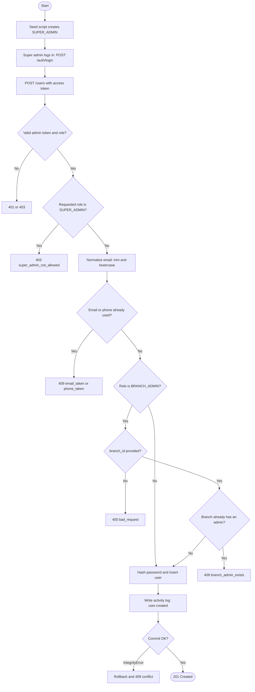
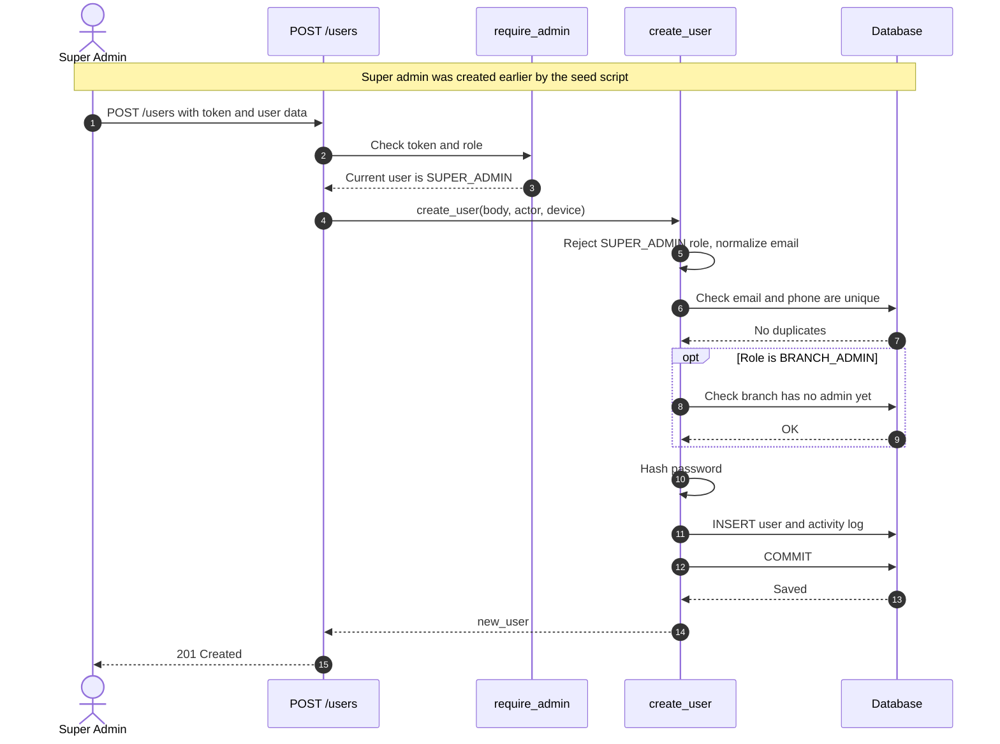
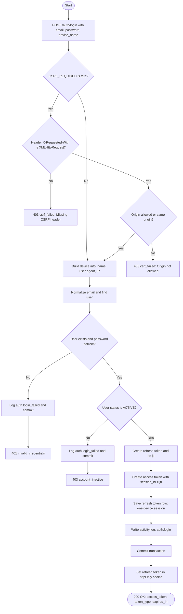
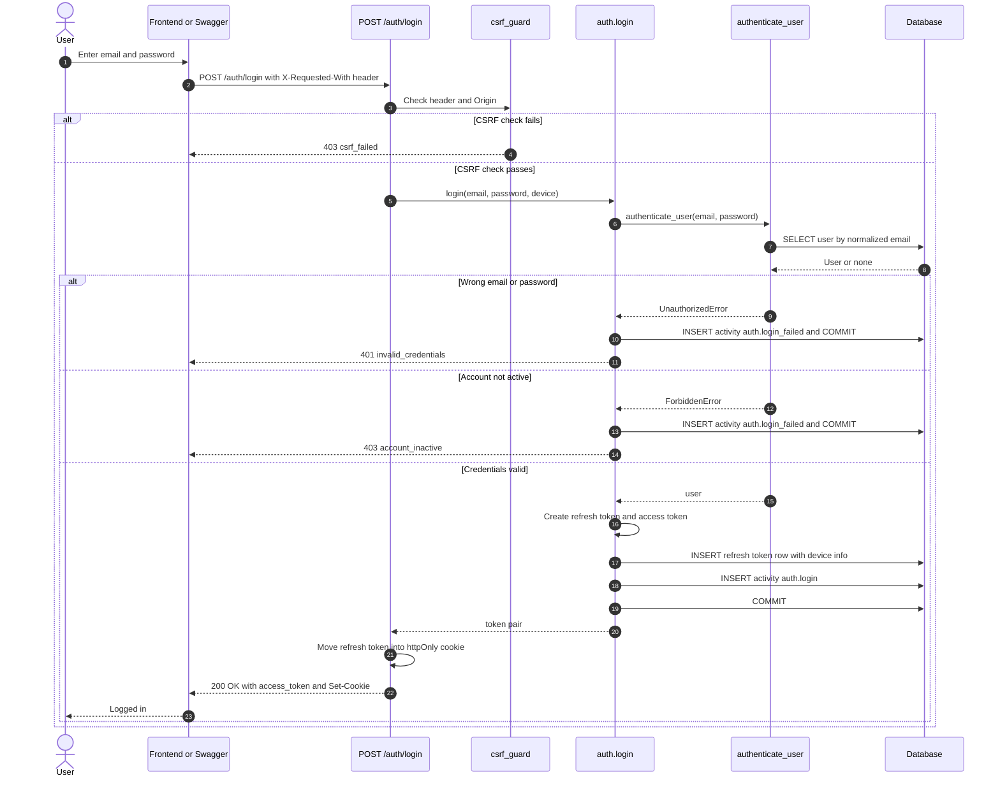

```mermaid
flowchart TD
    A(["Start"]) --> B["Seed script creates SUPER_ADMIN"]
    B --> C["Super admin logs in: POST /auth/login"]
    C --> D["POST /users with access token"]
    D --> E{"Valid admin token and role?"}
    E -- No --> E1["401 or 403"]
    E -- Yes --> F{"Requested role is SUPER_ADMIN?"}
    F -- Yes --> F1["403 super_admin_not_allowed"]
    F -- No --> G["Normalize email: trim and lowercase"]
    G --> H{"Email or phone already used?"}
    H -- Yes --> H1["409 email_taken or phone_taken"]
    H -- No --> I{"Role is BRANCH_ADMIN?"}
    I -- No --> L["Hash password and insert user"]
    I -- Yes --> J{"branch_id provided?"}
    J -- No --> J1["400 bad_request"]
    J -- Yes --> K{"Branch already has an admin?"}
    K -- Yes --> K1["409 branch_admin_exists"]
    K -- No --> L
    L --> M["Write activity log: user.created"]
    M --> N{"Commit OK?"}
    N -- IntegrityError --> N1["Rollback and 409 conflict"]
    N -- Yes --> O(["201 Created"])
```

```mermaid
sequenceDiagram
    autonumber
    actor SA as Super Admin
    participant API as POST /users
    participant Dep as require_admin
    participant CRUD as create_user
    participant DB as Database

    Note over SA,DB: Super admin was created earlier by the seed script
    SA->>API: POST /users with token and user data
    API->>Dep: Check token and role
    Dep-->>API: Current user is SUPER_ADMIN
    API->>CRUD: create_user(body, actor, device)
    CRUD->>CRUD: Reject SUPER_ADMIN role, normalize email
    CRUD->>DB: Check email and phone are unique
    DB-->>CRUD: No duplicates
    opt Role is BRANCH_ADMIN
        CRUD->>DB: Check branch has no admin yet
        DB-->>CRUD: OK
    end
    CRUD->>CRUD: Hash password
    CRUD->>DB: INSERT user and activity log
    CRUD->>DB: COMMIT
    DB-->>CRUD: Saved
    CRUD-->>API: new_user
    API-->>SA: 201 Created
```

```mermaid
flowchart TD
    A(["Start"]) --> B["POST /auth/login with email, password, device_name"]
    B --> C{"CSRF_REQUIRED is true?"}
    C -- No --> F
    C -- Yes --> D{"Header X-Requested-With is XMLHttpRequest?"}
    D -- No --> D1["403 csrf_failed: Missing CSRF header"]
    D -- Yes --> E{"Origin allowed or same origin?"}
    E -- No --> E1["403 csrf_failed: Origin not allowed"]
    E -- Yes --> F["Build device info: name, user agent, IP"]
    F --> G["Normalize email and find user"]
    G --> H{"User exists and password correct?"}
    H -- No --> H1["Log auth.login_failed and commit"]
    H1 --> H2["401 invalid_credentials"]
    H -- Yes --> I{"User status is ACTIVE?"}
    I -- No --> I1["Log auth.login_failed and commit"]
    I1 --> I2["403 account_inactive"]
    I -- Yes --> J["Create refresh token and its jti"]
    J --> K["Create access token with session_id = jti"]
    K --> L["Save refresh token row: one device session"]
    L --> M["Write activity log: auth.login"]
    M --> N["Commit transaction"]
    N --> O["Set refresh token in httpOnly cookie"]
    O --> P(["200 OK: access_token, token_type, expires_in"])
```

```mermaid
sequenceDiagram
    autonumber
    actor U as User
    participant FE as Frontend or Swagger
    participant API as POST /auth/login
    participant CSRF as csrf_guard
    participant Svc as auth.login
    participant Users as authenticate_user
    participant DB as Database

    U->>FE: Enter email and password
    FE->>API: POST /auth/login with X-Requested-With header
    API->>CSRF: Check header and Origin
    alt CSRF check fails
        CSRF-->>FE: 403 csrf_failed
    else CSRF check passes
        API->>Svc: login(email, password, device)
        Svc->>Users: authenticate_user(email, password)
        Users->>DB: SELECT user by normalized email
        DB-->>Users: User or none
        alt Wrong email or password
            Users-->>Svc: UnauthorizedError
            Svc->>DB: INSERT activity auth.login_failed and COMMIT
            Svc-->>FE: 401 invalid_credentials
        else Account not active
            Users-->>Svc: ForbiddenError
            Svc->>DB: INSERT activity auth.login_failed and COMMIT
            Svc-->>FE: 403 account_inactive
        else Credentials valid
            Users-->>Svc: user
            Svc->>Svc: Create refresh token and access token
            Svc->>DB: INSERT refresh token row with device info
            Svc->>DB: INSERT activity auth.login
            Svc->>DB: COMMIT
            Svc-->>API: token pair
            API->>API: Move refresh token into httpOnly cookie
            API-->>FE: 200 OK with access_token and Set-Cookie
            FE-->>U: Logged in
        end
    end
```
